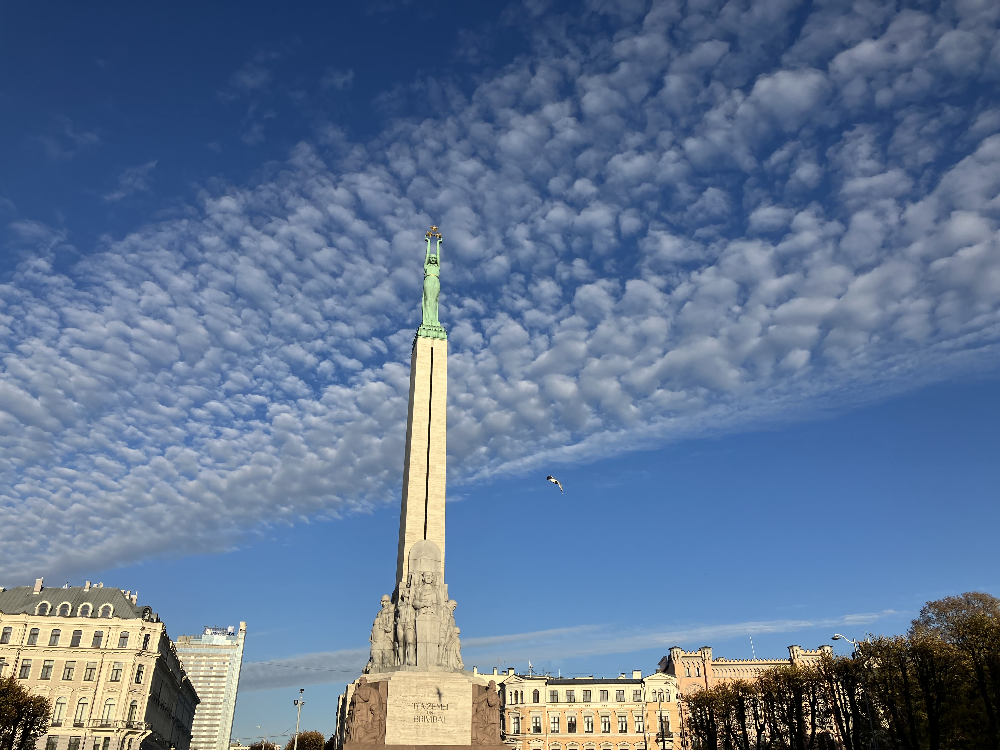
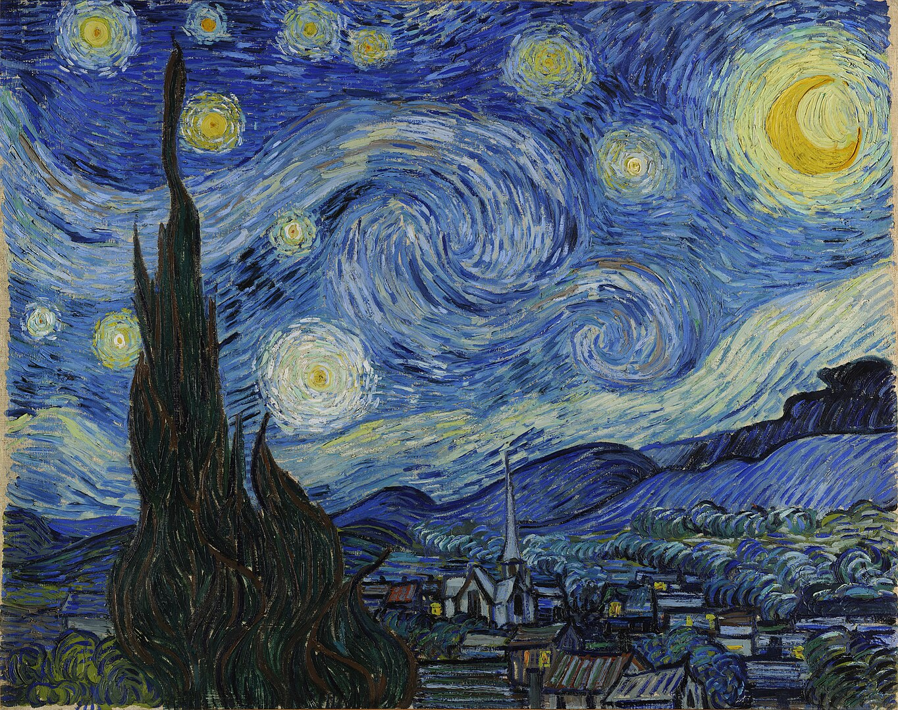
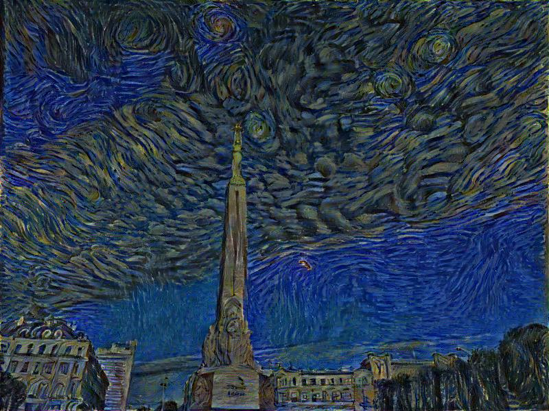

Implementing the very first neural style transfer algorithm from scratch

Backbone: VGG19

Example

Content image - Liberty Statue in Riga

Style image - Starry Night:
 

Generated image:

Some observations:

1. When initialize the target image to the content image, the target appears to go towards style image. The rate that it approaches the style image is highly dependent on the ratio between content loss and style loss.

2. When the content image and the style image has similar size, the target image has better visual results.

